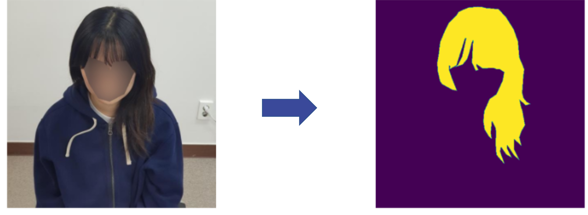
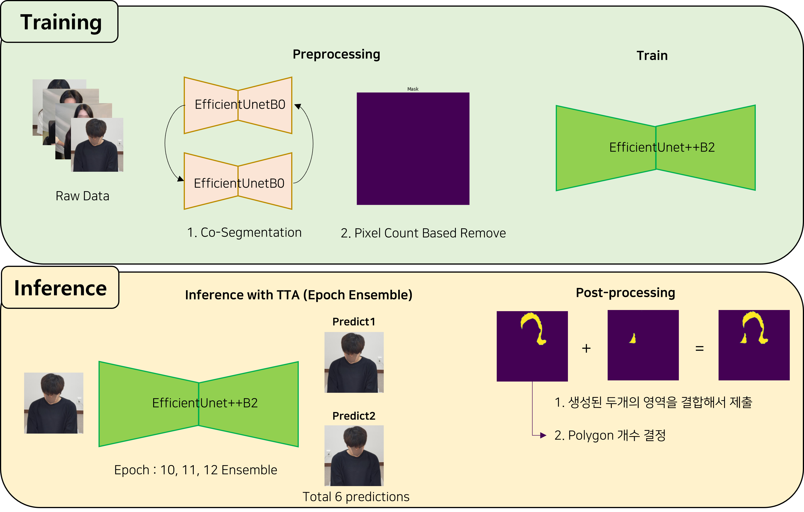
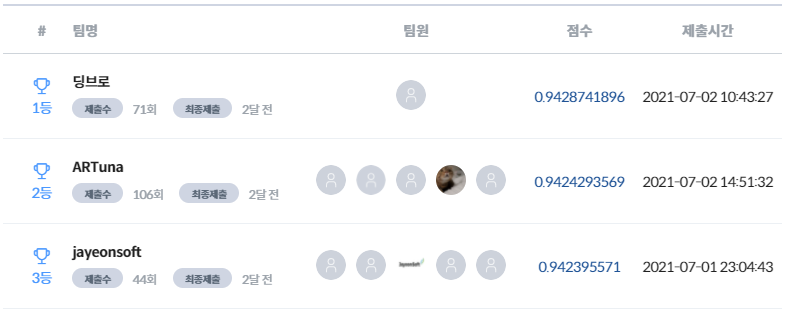

# :haircut: 한국인 헤어 세그멘테이션 경진대회 2등 솔루션

# Contents

#### Solution Description

#### Command Line Interface

- **Preprocess**
- **Train**
- **Predict**


# Solution Description

## Subject

본 대회의 주제는 한국인 헤어에 대해서 세그멘테이션을 수행하는 AI 모델 개발입니다. 주어진 이미지는 아래의 그림과 같이 다양한 헤어스타일에 대해서 세그멘테이션을 수행해야 할 필요가 있었습니다. 




## Data

- 학습 데이터: 약 20만장의 512x512 헤어스타일 이미지
- 경진대회의 데이터의 경우 저작권의 문제때매, 예시 이미지의 경우 AI Hub에서 제공하는 한국인 헤어스타일 데이터셋의 예시를 사용했습니다.  
- 이미지 데이터 : https://aihub.or.kr/aidata/30752


## Summary



## Score




## Code Structure

```bash
├── DATA
│   ├── Final_DATA
│   │   ├── task02_test
│   │   └── task02_train
│   ├── polygon_iou.json
│   └── data.csv
├── config
│   └── config.yaml
├── model
│   ├── submission_model_weight
│   └── preprocessing
│       └── preprocessing_model_weight
├── modules
│   ├── dataset.py
│   ├── models.py
│   ├── preprocessing.py
│   ├── scheduler.py
│   ├── solver.py
│   ├── transform.py
│   └── utils.py
├── output
│   ├── log
│   ├── runs
│   │   └── output_model_weight
│   └── result.json
├── README.md
├── predict.py
└── train.py
```

# Command Line Interface


## Preprocess

```console
python preprocess.py
```


## Train

```console
python train.py
```


## Predict 

```console
python predict.py
```

